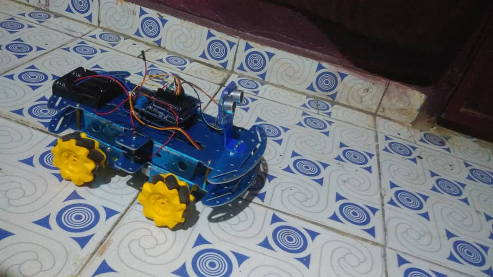

# Projet d'Électronique et d'Interfaçage : `SIGH EYES`

  
*Maquette du projet*  

<em>Cliquez sur l'image pour voir la vidéo de démonstration</em>

---

## Table des Matières
1. [Introduction](#introduction)  
2. [Structure du Projet](#structure-du-projet)  
3. [Matériel et Composants Utilisés](#matériel-et-composants-utilisés)  
4. [Modules et Fonctionnalités](#modules-et-fonctionnalités)  
   - [Module 1 : Alimentation et signalisation](#module-1--alimentation-et-signalisation)  
   - [Module 2 : Montage du chassis](#module-2--montage-du-chassis)  
   - [Module 3 : Analyse d'images](#module-3--analyse-dimages)

    - [Module 4 : Interface utilisateur](#module-4--interfaces-utilisateur)  
5.  [Déploiement et Utilisation](#déploiement-et-utilisation)  
6. [Problèmes Connus et Résolution](#problèmes-connus-et-résolution)  
7. [Contribution](#contribution)  
8. [Licence](#licence)  

---

### Introduction
Ce projet explore la mise en place d'un système électronique combinant du matériel et une interface logicielle. Il vise à vise à développer un robot capable d’observer son environnement, faire l’analyse d’images et détecter un objet ayant un certain nombre de caractéristiques et de diriger vers cet objet tout ceci en utilisant des modules interconnectés.

Pour plus d'informations, bien vouloir consulter la documentation du projet en cliquant sur le lien ci-dessous:

📁 **Lien vers la documentation detaillée du projet** : [Documentation](/documentation/Readme.md)

---

### Structure du Projet
Le projet est structuré comme suit :  
- **/code** : Contiendra le code source des différents modules.Mais pour le moment,contient les exemples de codes utilisés pour l'apprentissage des modules.  
- **/rapport_evolution_phases** : Ici on retrouve les différents rapports des différentes phases de travail de notre projet.  
- **/documentation** : Documentation et ressources.  
- **/media** : Images et vidéos de démonstration.  

📁 **Lien vers les fichiers :** [Structure complète](/documentation/structure.md)  

---
### Matériel et Composants Utilisés

#### Microcontrôleur  
- **ESP32-CAM** : Module microcontrôleur avec caméra intégrée pour capturer des images et transmettre des données via Wi-Fi.  
- **Arduino UNO** : Pour le contrôle des capteurs et des actionneurs.  

#### Capteurs  
- **Capteur ultrasonique HC-SR04** : Mesure la distance pour éviter les obstacles.  
- **Capteur de lumière** : Pour détecter l'intensité lumineuse ambiante.  
- **Capteur infrarouge** : Détecte les objets proches et peut être utilisé pour des lignes de guidage.  

#### Modules complémentaires  
- **Module de commande moteur L298N** : Permet de contrôler les moteurs à courant continu.  
- **Servomoteurs SG90** : Utilisés pour diriger les caméras ou les capteurs rotatifs.  
- **LED RGB WS2812** : Fournit des indications visuelles sur l'état du robot.  

#### Écran d'affichage  
- **Écran OLED 0.96"** : Pour afficher des informations telles que la distance détectée ou l’état du robot.  

#### Châssis et roues  
- **Châssis en aluminium** : Fournit une base robuste et légère pour monter les composants.  
- **Roues Mecanum (x4)** : Permettent des déplacements omnidirectionnels.  

#### Batterie et alimentation  
- **Batteries 18650 (x2)** : Alimentent le robot pour une utilisation prolongée.  
- **Support batterie** : Maintient les batteries en place et permet de les remplacer facilement.  

#### Autres composants  
- **Visserie et outils** : Utilisés pour l'assemblage mécanique du robot.  
- **Câbles et connecteurs** : Pour relier les différents modules entre eux.  

📄 **Lien vers le document presentant en detail les composants  :** [Rapport maquette et materiel](./docs/components.pdf)  

---

### Modules et Fonctionnalités

#### Module 1 : Alimentation et signalisation
- **Description** : Ce module gere principalement l'alimentation de notre robot et la gestion des signaux.
- **Points importants** : utilise une plaque solaire
- 📁 [Lien vers le module](code/Module_alimentation_signalisation_alerte/README.md) 

#### Module 2 : Montage du chassis
- **Description** : 
- **Points importants** :
- 📁 [Lien vers le module](code/Module_Chassis/README.md) 

#### Module 3 : Analyse d'images
- **Description** : Ici on se charge de traiter le flux video pour la reconnaissance de l'objet
- **Points importants** : utilise le `Rasbery-py` surlequel tourne notre algorithme
- 📁 [Lien vers le module](./src/module1_acquisition.md) 

#### Module 4 : Interfaces utilisateur
- **Description** : C'est a partir d'ici qu'on permet a l'utilisateur d'interagir avec son robot
- **Points importants** : il le fait a partir d'une application web
- 📁 [Lien vers le module](./src/module1_acquisition.md)  

---

### Déploiement et Utilisation
Cette section n'est pas encore disponible, elle le sera une fois le projet terminé

---

### Problèmes Connus et Résolution
- **Problème** : Le capteur ne renvoie pas de données.  
  Solution : Vérifier les connexions et l’alimentation.  

📄 **Lien vers la FAQ :** [Problèmes connus](./docs/issues.md)  

---

### Contribution
Vous êtes les bienvenus pour contribuer à ce projet !  
Si vous etes interessez, contactez notre enseignant:  

📄 **Lien vers le guide de contribution :** [email de l'enseignant](www.####)  

---

### Licence

Ce projet est sous licence MIT. Cela signifie que vous êtes libre d'utiliser, modifier, distribuer et vendre ce robot tant que vous incluez une copie de la licence dans tout projet dérivé. Cependant, aucune garantie n'est fournie avec ce robot, y compris son adéquation à un usage particulier.

 
📄 **Lien vers le fichier de licence :** [Licence](./LICENSE)  

---
