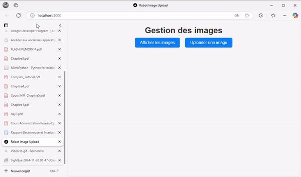

# Projet de gestion d'images avec interface Web et bot Telegram

## Description

Ce projet combine une application Web et un bot Telegram permettant :
- Le téléchargement et la gestion d'images.
- L'envoi d'images sélectionnées à un robot ESP32-CAM.
- L'interaction avec le robot via des signaux comme *pause* ou *cancel*.

L'application Web et le bot Telegram sont synchronisés avec une base de données MySQL pour stocker et gérer les images.

---

## Arborescence du projet

```
- db/
  - database.sql        
- gifs/
  - web.gif             
  - bot.gif             
- Telegram/
  - bot.py              
  - database.sql        
- Web/
  - backend/            
  - frontend/           
```

---

## Fonctionnalités principales

### Bot Telegram
- **Upload d'images** : permet d'envoyer des images au bot pour les stocker dans la base de données.
- **Recherche d'images** : affiche une liste d'images disponibles avec leurs dates d'enregistrement.
- **Sélection d'image** : transfert une image choisie au robot ESP32-CAM.
- **Signaux au robot** : commande pour annuler ou mettre en pause les actions du robot.

### Application Web
- **Interface utilisateur moderne et responsive** en ReactJS.
- **Gestion complète des images** : upload, visualisation, transfert au robot.
- **Base de données commune avec le bot Telegram.**

---

## Tutoriels d'utilisation

### Bot Telegram


### Application Web


---

## Prérequis

1. **Technologies requises** :
   - Python 3.x
   - Node.js et npm
   - MySQL
   - ESP32-CAM avec microprogramme configuré

2. **Bibliothèques Python** :
   ```bash
   pip install telebot mysql-connector-python requests
   ```

3. **Modules Node.js** :
   - Express, Sequelize, body-parser, et autres nécessaires (voir `package.json` dans `Web/backend/`).

---

## Installation

### Étape 1 : Configurer la base de données
1. Créez une base de données MySQL et importez le fichier SQL situé dans `db/database.sql`.

   Exemple :
   ```bash
   mysql -u root -p < db/database.sql
   ```

2. Mettez à jour les fichiers `bot.py` et le backend avec vos informations de connexion MySQL.

---

### Étape 2 : Lancer le bot Telegram
1. Rendez-vous dans le dossier `Telegram/`.
2. Configurez le fichier `bot.py` avec votre token Telegram et l'adresse IP de l'ESP32-CAM.
3. Lancez le bot :
   ```bash
   python bot.py
   ```

---

### Étape 3 : Lancer l'application Web
1. Allez dans le dossier `Web/backend` et démarrez le serveur backend :
   ```bash
   node server.js
   ```
2. Dans un autre terminal, naviguez vers `Web/frontend` et démarrez le serveur frontend :
   ```bash
   npm start
   ```

---

## Fonctionnement du robot ESP32-CAM
- L'ESP32-CAM doit être configuré pour écouter sur `http://192.168.24.77/` et accepter des requêtes POST pour le transfert d'images.
- Deux endpoints supplémentaires doivent être définis :
  - **/pause** : pour mettre le robot en pause.
  - **/cancel** : pour annuler l'opération en cours.